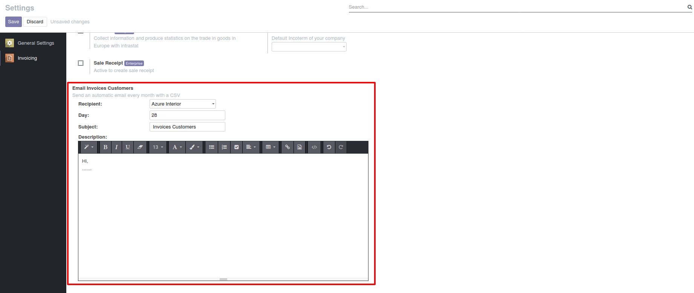

# SO Projekt

This module allows to send an automatic mail every month with a CSV file.

**Table of contents**

- [Configuration](#configuration)
- [Usage](#usage)

## Configuration

In the settings:

- Add the Recipient
- Add the Day
- Add the Subject
- Add the Description

## Usage

Every month according to a choosed day in settings, an automatic mail with a CSV file is sended to recipient containing the subject and the description.
